# AI 配置模块 - 产品需求文档 (PRD)

> 版本：v1.1
> 日期：2026-03-11
> 模块路径：系统配置 → AI 配置
> 前端路由：`/ai-config/*`

## 1. 概述

AI 配置模块是 Nightingale 平台的 AI 能力管理中心，用于统一管理 AI Agent、LLM 大语言模型、Skill 技能、MCP Server 四大核心资源。用户可以在此配置 AI 对话所需的模型、技能和工具服务，并将它们组合为 Agent 对外提供 AI 服务。

模块入口组件通过 `PageLayout` 渲染页面标题 "AI 配置"，根据当前 URL pathname 动态渲染对应的子模块内容。

模块包含四个 Tab 页：

| Tab | 路由 | 说明 |
|-----|------|------|
| Agent 管理 | `/ai-config/agents` | 管理 AI Agent，定义其关联的 LLM、Skill 和 MCP Server |
| LLM 管理 | `/ai-config/llm-configs` | 管理大语言模型配置，包含 API 连接信息和模型参数 |
| Skill 管理 | `/ai-config/skills` | 管理 Agent 可使用的技能（提示词指令） |
| MCP 管理 | `/ai-config/mcp-servers` | 管理 MCP (Model Context Protocol) 远程工具服务器 |

---

## 2. Agent 管理

### 2.1 页面说明

Agent 是 AI 对话的执行主体，它将 LLM、Skill、MCP Server 三者组合在一起，定义了一个完整的 AI 对话能力。

### 2.2 列表页

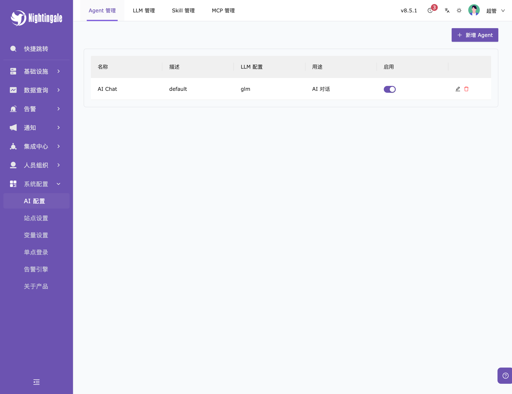

列表以表格形式展示所有已配置的 Agent。

| 列名 | 字段 | 说明 |
|------|------|------|
| 名称 | `name` | Agent 的唯一标识名称 |
| 描述 | `description` | Agent 的用途描述，超长时省略显示（`ellipsis: true`） |
| LLM 配置 | `llm_config_id` | 关联的 LLM 配置名称。若未找到对应 LLM 配置则显示 `-` |
| 用途 | `use_case` | Agent 的使用场景，通过 i18n 翻译显示（如 "AI 对话"），无值时显示 `-` |
| 启用 | `enabled` | 小尺寸开关（`Switch size='small'`），控制 Agent 是否可用（1=启用，0=禁用） |
| 操作 | - | 编辑（`EditOutlined` 图标）、删除（`DeleteOutlined` 红色图标） |

**按钮与交互**：

| 按钮/操作 | 位置 | 交互说明 |
|-----------|------|----------|
| `+ 新增 Agent` | 列表右上角 | 主按钮（`type='primary'`），带 `PlusOutlined` 图标。点击后打开右侧新增抽屉，`editData` 设为 `undefined` |
| 启用开关 | 表格行内 | 点击后立即调用 `updateAgent` 接口切换 `enabled` 状态（0↔1），然后刷新列表 |
| 编辑图标 | 操作列 | 点击后将该行数据设为 `editData`，打开编辑抽屉 |
| 删除图标 | 操作列 | 红色 `DeleteOutlined`，点击后弹出 `Popconfirm` 确认框，提示文案："确定删除该 Agent？"。确认后调用 `deleteAgent` 接口，成功提示 "Deleted" 并刷新列表 |

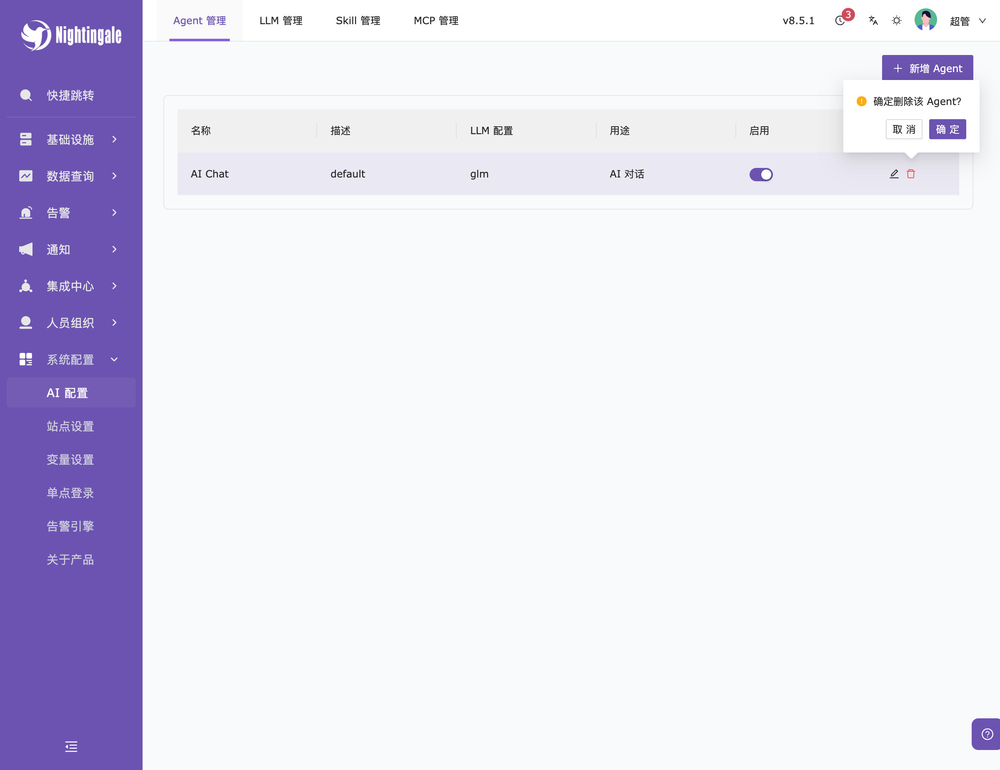

### 2.3 新增/编辑抽屉


抽屉（`Drawer`）从右侧滑出，宽度 600px，`destroyOnClose` 关闭时销毁内容。标题根据模式显示为 "新增 Agent" 或 "编辑 Agent"。

#### 表单字段

| 字段 | 字段名 | 类型 | 必填 | Placeholder | Tooltip | 说明 |
|------|--------|------|------|-------------|---------|------|
| 名称 | `name` | `Input` 文本输入 | 是 | （无） | （无） | Agent 的名称。与"用途"同行，占 `Col span={16}` |
| 用途 | `use_case` | `Select` 下拉选择 | 是 | （无） | "此 Agent 主要在什么场景使用"（`QuestionCircleOutlined` 问号图标触发） | 与"名称"同行，占 `Col span={8}`。当前可选值：`chat`（显示 "AI 对话"）。新增时默认选中 `chat` |
| 描述 | `description` | `Input.TextArea` 多行文本（2行） | 否 | "描述该 Agent 的用途..." | （无） | 描述该 Agent 的用途 |
| 启用 | `enabled` | `Switch` 开关 | - | - | （无） | 默认启用（新增时 `enabled: true`）。控制 Agent 是否激活 |
| 选择 LLM | `llm_config_id` | `Select` 下拉选择 | 是 | "请选择已配置的 LLM..." | （无） | 选择一个已配置且已启用的 LLM（`enabled === 1`）。下拉选项格式：`{名称} ({提供商类型} / {模型})`。支持搜索（`showSearch`、`optionFilterProp='children'`），支持清除（`allowClear`）。字段上方有分隔线（`Divider`）与基础信息区分 |
| 关联 Skill | `skill_ids` | `Select mode='multiple'` 多选下拉 | 否 | "选择要关联的 Skill..." | "被关联的 Skill 会优先考虑使用"（`QuestionCircleOutlined` 问号图标触发） | 仅显示已启用的 Skill（`enabled === 1`），支持搜索和清除 |
| 关联 MCP Server | `mcp_server_ids` | `Select mode='multiple'` 多选下拉 | 否 | "选择要关联的 MCP Server..." | "配置该 Agent 可以使用哪些 MCP Server"（`QuestionCircleOutlined` 问号图标触发） | 仅显示已启用的 MCP Server（`enabled === 1`），支持搜索和清除 |

**label 附加内容**：
- "选择 LLM" label 右侧有 `新建 LLM` 链接（`<a>` 标签），点击打开内嵌的 LLM 配置抽屉（`LLMConfigDrawer`）。新建 LLM 成功关闭后，自动刷新 LLM 列表并将最新启用的 LLM 自动选中到表单中。

**底部按钮**：

| 按钮 | 位置 | 交互说明 |
|------|------|----------|
| 取消 | 抽屉底部右侧 | 关闭抽屉，不保存 |
| 保存 | 抽屉底部右侧 | 主按钮（`type='primary'`），带 loading 状态。触发表单校验，校验通过后：新增调用 `addAgent`，编辑调用 `updateAgent`。成功后提示 "Created" 或 "Updated"，关闭抽屉并刷新列表 |

**编辑模式数据回填效果**：

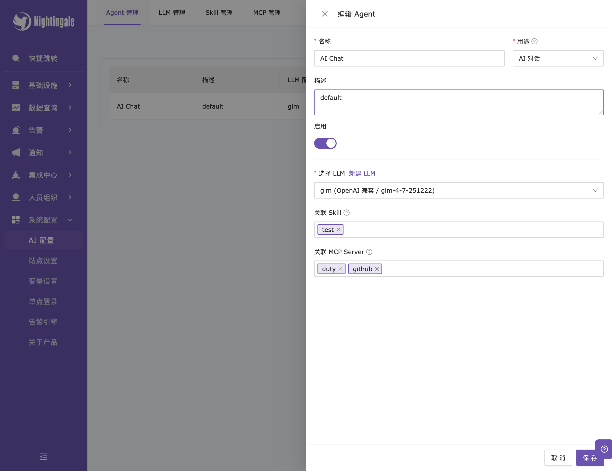

### 2.4 数据模型

```typescript
interface AIAgent {
  id: number;              // 自增主键
  name: string;            // Agent 名称
  description: string;     // 描述
  use_case: string;        // 用途，如 "chat"
  llm_config_id: number;   // 关联的 LLM 配置 ID
  skill_ids: number[];     // 关联的 Skill ID 列表
  mcp_server_ids: number[];// 关联的 MCP Server ID 列表
  enabled: number;         // 是否启用 (0/1)
  created_at: number;      // 创建时间戳
  created_by: string;      // 创建人
  updated_at: number;      // 更新时间戳
  updated_by: string;      // 更新人
}
```

### 2.5 API 接口

| 方法 | 路径 | 说明 |
|------|------|------|
| GET | `/api/n9e/ai-agents` | 获取所有 Agent 列表 |
| POST | `/api/n9e/ai-agents` | 新增 Agent |
| PUT | `/api/n9e/ai-agent/{id}` | 更新指定 Agent |
| DELETE | `/api/n9e/ai-agent/{id}` | 删除指定 Agent |
| POST | `/api/n9e/ai-agent/{id}/test` | 测试 Agent 的 LLM 连接 |

---

## 3. LLM 管理

### 3.1 页面说明

LLM 管理用于配置大语言模型的连接信息和参数，支持 OpenAI 兼容、Anthropic Claude、Google Gemini 三种提供商类型。

### 3.2 列表页

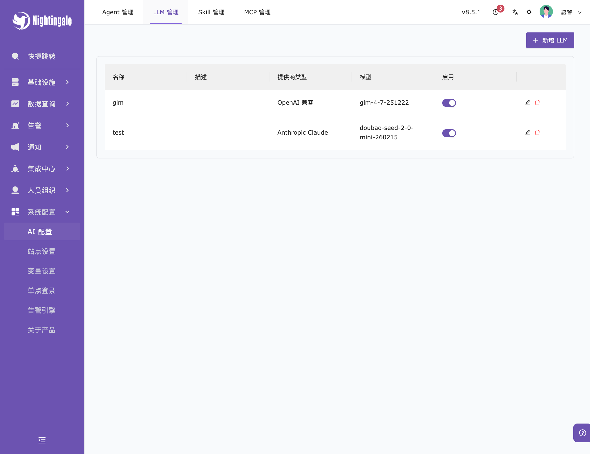

列表以表格形式展示所有已配置的 LLM，不分页。

| 列名 | 字段 | 说明 |
|------|------|------|
| 名称 | `name` | LLM 配置的名称 |
| 描述 | `description` | 配置描述，超长时省略显示（`ellipsis: true`） |
| 提供商类型 | `api_type` | 模型提供商类型，通过 i18n 翻译显示，无值时显示 `-` |
| 模型 | `model` | 模型名称/ID |
| 启用 | `enabled` | 小尺寸开关 |
| 操作 | - | 编辑（`EditOutlined`）、删除（`DeleteOutlined` 红色） |

**按钮与交互**：

| 按钮/操作 | 位置 | 交互说明 |
|-----------|------|----------|
| `+ 新增 LLM` | 列表右上角 | 主按钮，带 `PlusOutlined` 图标。点击打开新增抽屉 |
| 启用开关 | 表格行内 | 点击后立即调用 `updateLLMConfig` 切换状态，刷新列表 |
| 编辑图标 | 操作列 | 点击打开编辑抽屉，传入该行数据 |
| 删除图标 | 操作列 | 红色图标，`Popconfirm` 确认框提示："确定删除该 LLM 配置？"。确认后调用 `deleteLLMConfig`，成功提示 "Deleted" |

### 3.3 新增/编辑抽屉

#### 基础配置

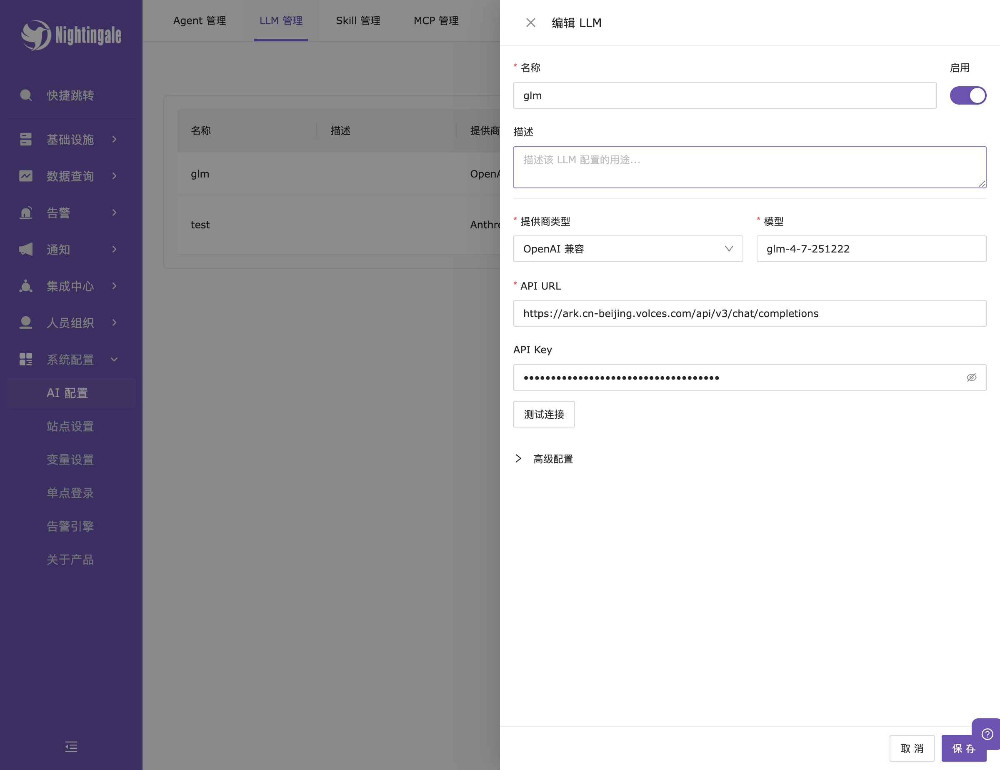

抽屉宽度 600px，`destroyOnClose`。标题为 "新增 LLM" 或 "编辑 LLM"。

| 字段 | 字段名 | 类型 | 必填 | Placeholder | Tooltip | 说明 |
|------|--------|------|------|-------------|---------|------|
| 名称 | `name` | `Input` 文本输入 | 是 | （无） | （无） | 与"启用"同行，名称占 `Col flex='auto'`，启用开关独立一列 |
| 启用 | `enabled` | `Switch` 开关 | - | - | （无） | 默认启用。与"名称"同行 |
| 描述 | `description` | `Input.TextArea`（2行） | 否 | "描述该 LLM 配置的用途..." | （无） | |
| 提供商类型 | `api_type` | `Select` 下拉选择 | 是 | （无） | （无） | 可选值见下表。新增时默认选中 `openai`。与"模型"同行各占 `Col span={12}` |
| 模型 | `model` | `Input` 文本输入 | 是 | `gpt-4o` | （无） | 与"提供商类型"同行 |
| API URL | `api_url` | `Input` 文本输入 | 是 | `https://api.openai.com/v1` | （无） | API 端点地址 |
| API Key | `api_key` | `Input.Password` 密码输入 | 新增时必填，编辑时可选 | 编辑时显示 `••••••••`，新增时无 placeholder | （无） | 支持切换显示/隐藏 |

**提供商类型选项**：

| 值 | 中文名称 | 英文名称 |
|----|----------|----------|
| `openai` | OpenAI 兼容 | OpenAI Compatible |
| `claude` | Anthropic Claude | Anthropic Claude |
| `gemini` | Google Gemini | Google Gemini |

**测试连接**：

| 按钮 | 位置 | 交互说明 |
|------|------|----------|
| 测试连接 | API Key 下方，基础配置区域末尾 | 普通按钮，带 loading 状态。点击后调用 `testLLMConfig` 接口，传入当前表单值（`api_type`, `api_url`, `api_key`, `model`）。编辑模式额外传入 `id`。结果以 `Tag` 标签显示在按钮右侧：成功 → 绿色 Tag "连接成功 ({duration_ms}ms)"；失败 → 红色 Tag "连接失败" |

**底部按钮**：

| 按钮 | 位置 | 交互说明 |
|------|------|----------|
| 取消 | 抽屉底部右侧 | 关闭抽屉 |
| 保存 | 抽屉底部右侧 | 主按钮，带 loading。校验通过后新增调用 `addLLMConfig`，编辑调用 `updateLLMConfig`。成功提示 "Created"/"Updated" |

#### 高级配置（可折叠面板）

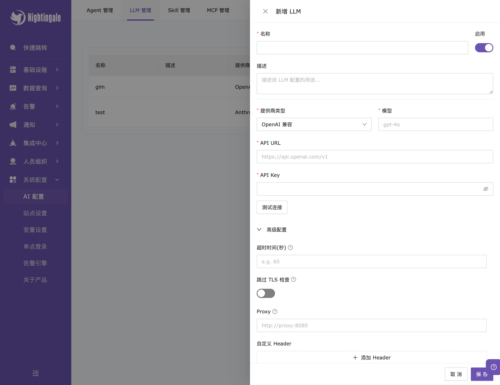

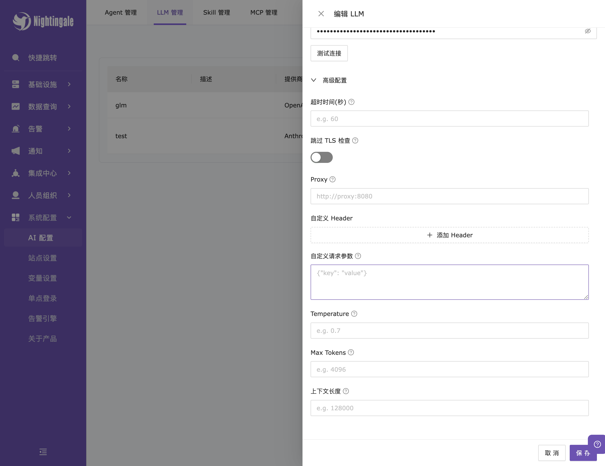

高级配置使用 `Collapse ghost` 面板，默认折叠。点击 "高级配置" 标题展开。所有高级参数在提交时汇总到 `extra_config` 对象中。

| 字段 | 字段名 | 类型 | 必填 | Placeholder | Tooltip | 说明 |
|------|--------|------|------|-------------|---------|------|
| 超时时间(秒) | `timeout` → `extra_config.timeout_seconds` | `InputNumber`（`min={1}`） | 否 | `e.g. 60` | "单次 API 请求的超时时间，单位为秒" | 宽度 100% |
| 跳过 TLS 检查 | `skip_tls_verify` → `extra_config.skip_tls_verify` | `Switch` 开关 | 否 | - | "启用后将跳过 SSL/TLS 证书验证，适用于自签名证书场景" | |
| Proxy | `proxy` → `extra_config.proxy` | `Input` 文本输入 | 否 | `http://proxy:8080` | "HTTP 代理地址" | |
| 自定义 Header | `custom_headers` → `extra_config.custom_headers` | 动态键值对列表（`Form.List`） | 否 | 名称：i18n "Header 名称"；值：i18n "Header 值" | （无） | 每条包含 name 和 value。标题文字 "自定义 Header" 单独渲染在列表上方。可通过 "添加 Header" 虚线按钮（`type='dashed'`，`PlusOutlined` 图标）添加新行。每行末尾有 `MinusCircleOutlined` 删除按钮 |
| 自定义请求参数 | `custom_params` → `extra_config.custom_params` | `Input.TextArea`（3行） | 否 | `{"key": "value"}` | "支持自定义模型请求参数，如 temperature、top_p 等，JSON 格式\ne.g. {\"temperature\": 1.0, \"top_p\": 1.0, \"guided_choice\": [\"positive\", \"negative\"]}" | JSON 格式，提交时尝试 `JSON.parse` |
| Temperature | `temperature` → `extra_config.temperature` | `InputNumber`（`min={0}`, `max={2}`, `step={0.1}`） | 否 | `e.g. 0.7` | "控制输出随机性，值越高回复越多样，值越低越确定" | 宽度 100% |
| Max Tokens | `max_tokens` → `extra_config.max_tokens` | `InputNumber`（`min={1}`） | 否 | `e.g. 4096` | "模型单次回复的最大 Token 数" | 宽度 100% |
| 上下文长度 | `context_length` → `extra_config.context_length` | `InputNumber`（`min={1}`） | 否 | `e.g. 128000` | "模型支持的最大上下文窗口大小（Token 数）" | 宽度 100% |

### 3.4 数据模型

```typescript
interface LLMExtraConfig {
  timeout_seconds?: number;      // 超时时间（秒）
  skip_tls_verify?: boolean;     // 跳过 TLS 验证
  proxy?: string;                // 代理地址
  custom_headers?: Record<string, string>;  // 自定义 Header，键值对
  custom_params?: Record<string, any>;      // 自定义请求参数
  temperature?: number;          // 温度参数
  max_tokens?: number;           // 最大 Token 数
  context_length?: number;       // 上下文长度
}

interface AILLMConfig {
  id: number;              // 自增主键
  name: string;            // 配置名称
  description: string;     // 描述
  api_type: string;        // 提供商类型："openai" | "claude" | "gemini"
  api_url: string;         // API 端点 URL
  api_key: string;         // API 密钥
  model: string;           // 模型名称
  extra_config: LLMExtraConfig;  // 高级配置对象
  enabled: number;         // 是否启用 (0/1)
  created_at: number;      // 创建时间戳
  created_by: string;      // 创建人
  updated_at: number;      // 更新时间戳
  updated_by: string;      // 更新人
}
```

> 注意：前端 `extra_config` 使用对象类型 `LLMExtraConfig`，其中 `custom_headers` 以 `Record<string, string>` 存储，表单中以数组 `{name, value}[]` 编辑，提交时转换。

### 3.5 API 接口

| 方法 | 路径 | 说明 |
|------|------|------|
| GET | `/api/n9e/ai-llm-configs` | 获取所有 LLM 配置列表 |
| POST | `/api/n9e/ai-llm-configs` | 新增 LLM 配置 |
| PUT | `/api/n9e/ai-llm-config/{id}` | 更新指定 LLM 配置 |
| DELETE | `/api/n9e/ai-llm-config/{id}` | 删除指定 LLM 配置 |
| POST | `/api/n9e/ai-llm-config/test` | 测试 LLM 连接，请求体：`{api_type, api_url, api_key, model, extra_config?}`，始终传入具体配置 |

---

## 4. Skill 管理

### 4.1 页面说明

Skill（技能）是一组提示词指令，定义了 Agent 在特定场景下的行为方式。技能分为"内置技能"和"自定义技能"两类。内置技能的名称不可修改，自定义技能可完全编辑和删除。

### 4.2 列表页（左右分栏布局）

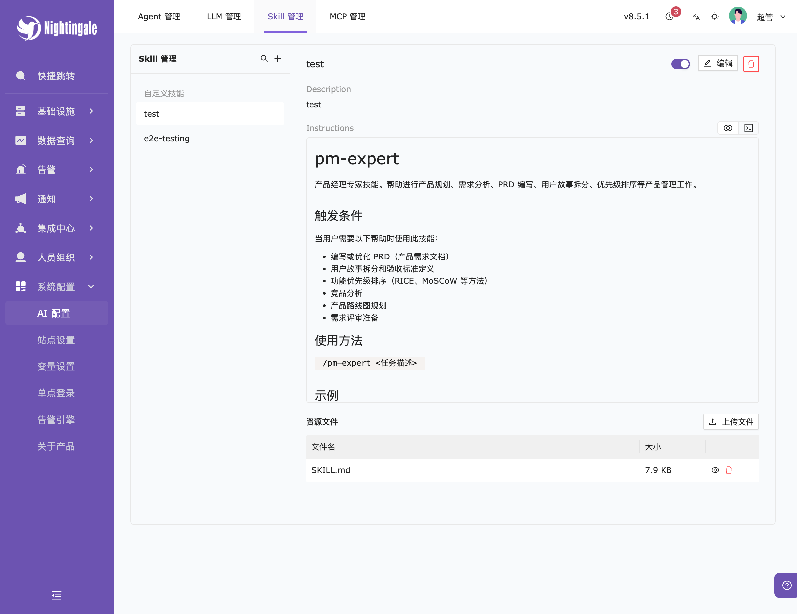

页面采用左右分栏布局，高度 `calc(100vh - 200px)`，外层有边框和圆角。

**左侧面板（240px 宽度）**：
- 顶部标题 "Skill 管理"，右侧有搜索图标（`SearchOutlined`）和新增图标（`PlusOutlined` + `Dropdown`）
- 搜索：点击搜索图标切换搜索框显示/隐藏（`showSearch` 状态控制），输入框 `size='small'`，支持 `allowClear`
  - placeholder："搜索技能..."
  - 输入内容通过 `search` 状态传递给 `getAISkills(search)` 接口实时过滤
- 新增下拉菜单（`Dropdown` + `Menu`）：
  - 「手动编写」（`skill.write`）- 打开编写 Skill 弹窗，`editData` 设为 `undefined`
  - 「上传文件」（`skill.upload`）- 触发隐藏的 `<input type="file" accept=".md">` 文件选择器。选择文件后调用 `importAISkill` 接口上传，成功提示 "Imported" 并刷新列表

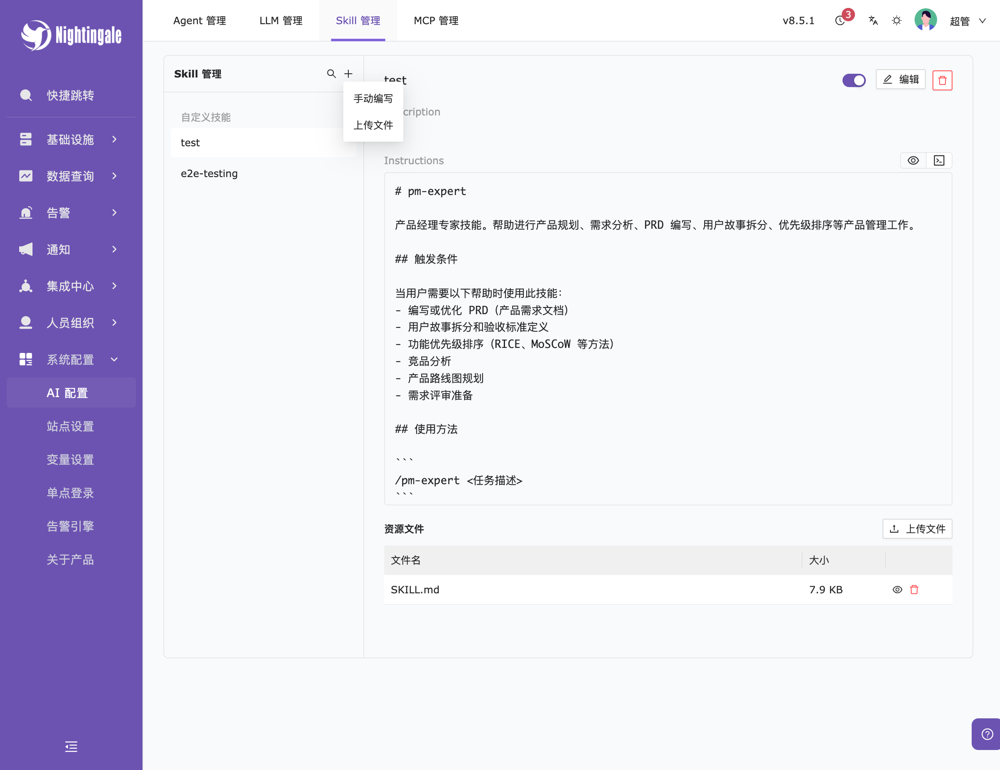

- 每个技能项显示名称（超长省略），未启用的技能旁显示灰色 "off" `Tag`（`color='default'`，字号 11px）
- 点击选中某个技能，背景变为 `var(--fc-fill-2)`，右侧显示详情
- 首次加载时自动选中第一个技能

**右侧面板（详情区域，padding 16px 24px）**：

未选中技能时显示 `Empty` 空状态，提示："请在左侧选择一个技能"。

选中技能后显示：

| 区域 | 交互说明 |
|------|----------|
| **标题行** | 左侧显示技能名称（`<h3>`），右侧依次：启用开关（`Switch size='small'`，直接调用 `updateAISkill` 切换状态）、编辑按钮（`Button size='small'`，`EditOutlined` 图标 + "编辑" 文字，点击打开编辑弹窗）、删除按钮（仅自定义技能显示，`Button size='small' danger`，`DeleteOutlined` 图标，`Popconfirm` 确认 "确定删除该技能？"） |
| **Description 区域** | 仅在有描述时显示。灰色小字标题 "Description"，下方显示描述文字 |
| **Instructions 区域** | 灰色小字标题 "Instructions"，右侧有视图切换按钮组（内联 flex 容器，带边框圆角）：预览模式（`EyeOutlined`）和源码模式（`CodeOutlined`），选中的按钮有背景色 `var(--fc-fill-2)`。预览模式：`Markdown` 组件渲染，容器最大高度 400px 可滚动。源码模式：`<pre>` 标签显示原始文本，等宽字体（Monaco, Menlo, monospace），字号 13px，最大高度 400px |
| **资源文件区域** | `ResourceFiles` 子组件，见下方详细说明 |

**源码模式效果**：

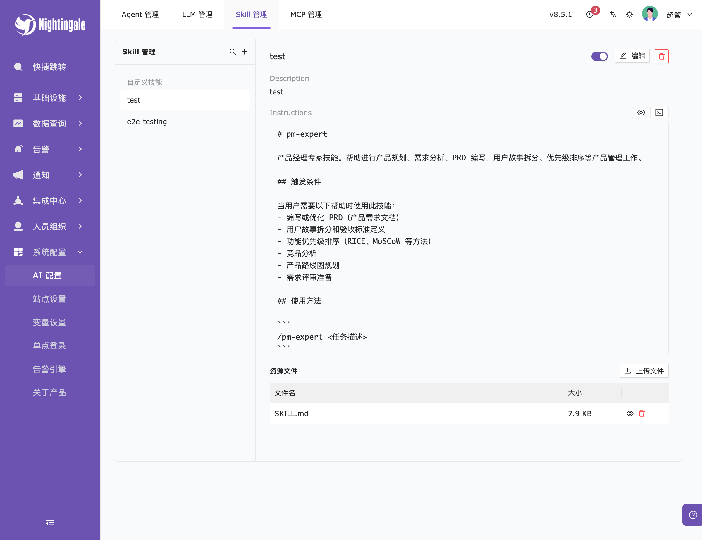

**资源文件区域**：
- 标题 "资源文件" + 「上传文件」按钮（`Button size='small'`，`UploadOutlined` 图标）
- 点击上传按钮触发隐藏的 `<input type="file" accept=".md,.txt,.json,.yaml,.yml,.csv">`，选择文件后调用 `uploadAISkillFile` 上传，成功提示 "Uploaded"
- 文件列表表格（`Table size='small'`，不分页）：

| 列名 | 字段 | 说明 |
|------|------|------|
| 文件名 | `name` | 文件名称 |
| 大小 | `size` | 自动格式化显示：`< 1KB` 显示 "N B"，`< 1MB` 显示 "N.N KB"，`>= 1MB` 显示 "N.N MB" |
| 操作 | - | 预览（`EyeOutlined`）、删除（`DeleteOutlined` 红色） |

| 按钮/操作 | 交互说明 |
|-----------|----------|
| 预览（眼睛图标） | 调用 `getAISkillFile(fileId)` 获取文件内容，在 `Modal`（宽 640px）中以 `<pre>` 显示，标题为文件名，最大高度 400px 可滚动，无底部按钮 |
| 删除（垃圾桶图标） | `Popconfirm` 确认 "Delete this file?"，确认后调用 `deleteAISkillFile`，成功提示 "Deleted" |

### 4.3 新增/编辑弹窗

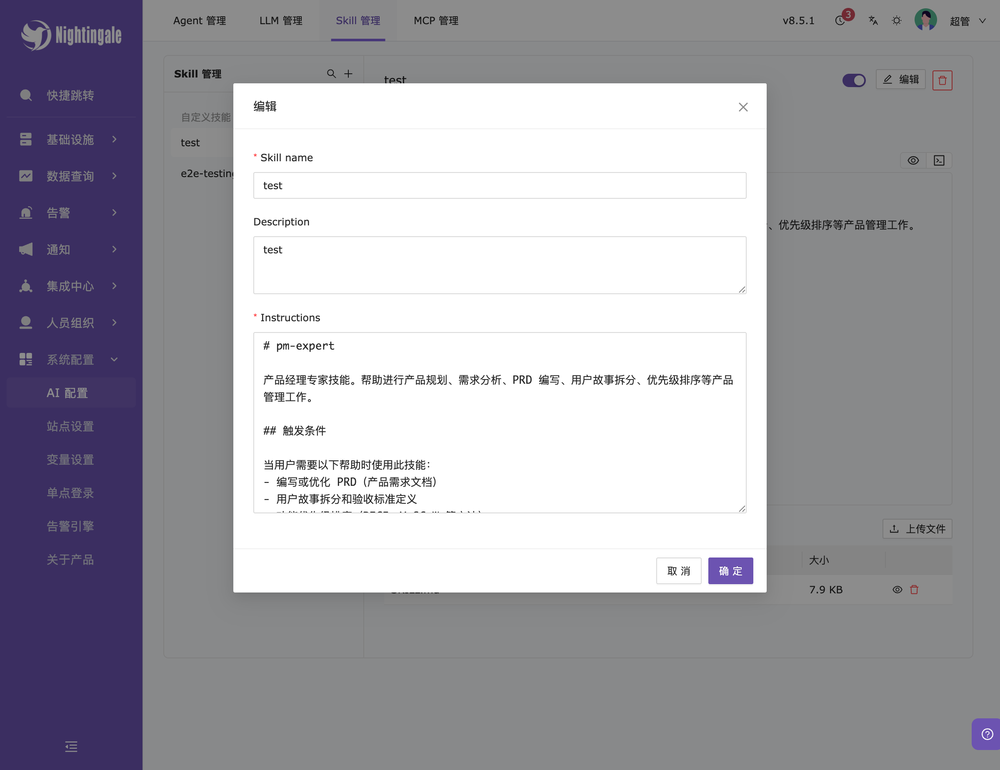

弹窗（`Modal`）宽度 640px，`destroyOnClose`。标题根据模式显示为 "手动编写" 或 "编辑"。确认按钮带 loading 状态。

| 字段 | 字段名 | 类型 | 必填 | Placeholder | Tooltip | 说明 |
|------|--------|------|------|-------------|---------|------|
| Skill name | `name` | `Input` 文本输入 | 是 | `my-skill-name` | （无） | |
| Description | `description` | `Input.TextArea`（3行） | 否 | "描述该技能的用途和触发场景..." | （无） | |
| Instructions | `instructions` | `Input.TextArea`（10行，等宽字体） | 是 | "编写提示词指令，支持 Markdown 格式..." | （无） | 字体：Monaco, Menlo, monospace，字号 13px |

**底部按钮**（Modal 默认按钮）：

| 按钮 | 交互说明 |
|------|----------|
| Cancel | 关闭弹窗 |
| OK | 带 loading。校验通过后：新增调用 `addAISkill`，编辑调用 `updateAISkill`。成功提示 "Created"/"Updated"，关闭弹窗并刷新列表 |

### 4.4 数据模型

```typescript
interface AISkill {
  id: number;              // 自增主键
  name: string;            // 技能名称
  description: string;     // 描述
  instructions: string;    // 提示词指令（Markdown 格式）
  enabled: number;         // 是否启用 (0/1)
  created_at: number;      // 创建时间戳
  created_by: string;      // 创建人
  updated_at: number;      // 更新时间戳
  updated_by: string;      // 更新人
}

interface AISkillFile {
  id: number;              // 文件 ID
  skill_id: number;        // 所属 Skill ID
  name: string;            // 文件名
  content?: string;        // 文件内容（查看时返回）
  size: number;            // 文件大小（字节）
  created_at: number;      // 创建时间戳
  created_by: string;      // 创建人
}
```

### 4.5 API 接口

| 方法 | 路径 | 说明 |
|------|------|------|
| GET | `/api/n9e/ai-skills` | 获取所有 Skill 列表，支持 `?search=` 关键字过滤 |
| GET | `/api/n9e/ai-skill/{id}` | 获取单个 Skill 详情 |
| POST | `/api/n9e/ai-skills` | 新增 Skill |
| PUT | `/api/n9e/ai-skill/{id}` | 更新指定 Skill |
| DELETE | `/api/n9e/ai-skill/{id}` | 删除指定 Skill |
| POST | `/api/n9e/ai-skills/import` | 导入 Skill 文件（FormData，字段名 `file`），仅支持 `.md` 格式 |
| GET | `/api/n9e/ai-skill/{skillId}/files` | 获取 Skill 的资源文件列表 |
| POST | `/api/n9e/ai-skill/{skillId}/files` | 上传资源文件（FormData） |
| GET | `/api/n9e/ai-skill-file/{fileId}` | 获取资源文件内容 |
| DELETE | `/api/n9e/ai-skill-file/{fileId}` | 删除资源文件 |

---

## 5. MCP 管理

### 5.1 页面说明

MCP (Model Context Protocol) 管理用于配置远程 MCP Server，使 Agent 能够调用外部工具和服务。仅支持远程 MCP Server，Server 需无需认证或支持自定义 Authorization Header。

### 5.2 列表页

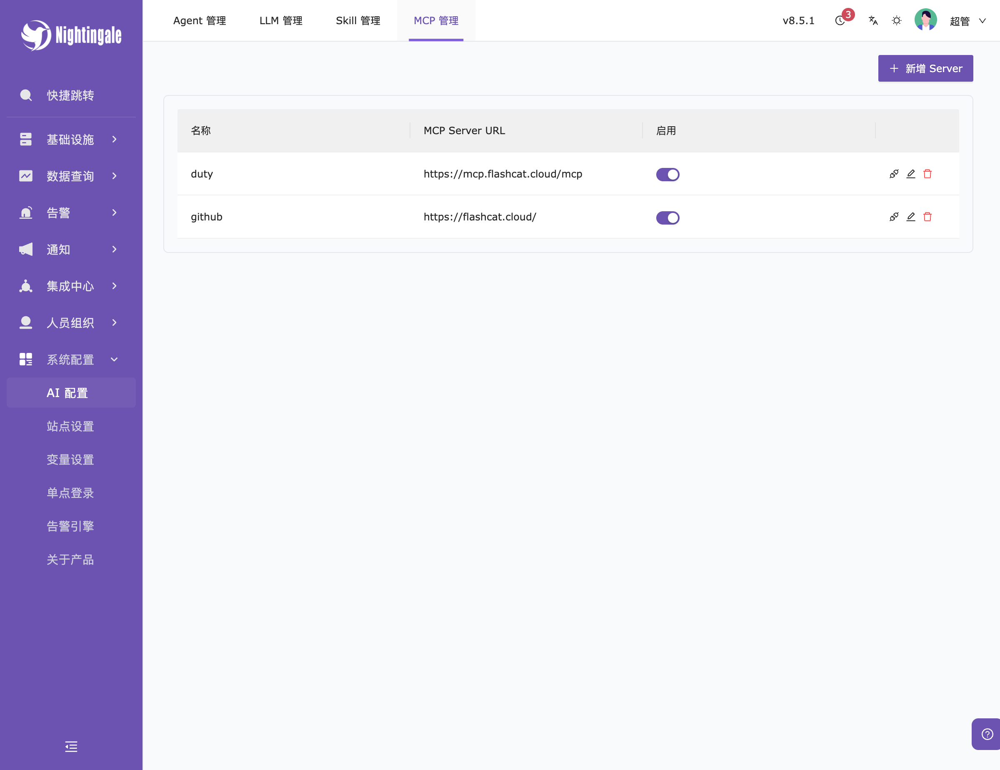

列表以表格形式展示，不分页。

| 列名 | 字段 | 说明 |
|------|------|------|
| 名称 | `name` | MCP Server 名称 |
| MCP Server URL | `url` | Server 的远程访问地址，超长时省略显示（`ellipsis: true`） |
| 启用 | `enabled` | 小尺寸开关 |
| 操作 | - | 测试连接（`ApiOutlined` 图标 + Tooltip）、编辑（`EditOutlined`）、删除（`DeleteOutlined` 红色） |

**按钮与交互**：

| 按钮/操作 | 位置 | 交互说明 |
|-----------|------|----------|
| `+ 新增 Server` | 列表右上角 | 主按钮，`PlusOutlined` 图标。点击打开新增弹窗 |
| 启用开关 | 表格行内 | 直接调用 `updateMCPServer` 切换状态 |
| 测试连接（`ApiOutlined`） | 操作列 | 带 `Tooltip` 提示 "测试连接"。点击后打开测试结果 `Modal`（宽 640px），显示加载中 `Spin`。先调用 `testMCPServer(id)` 接口测试连接，成功后再调用 `getMCPServerTools(id)` 获取工具列表。结果显示：成功 → 绿色 Tag "连接成功" + 耗时；失败 → 红色 Tag "连接失败" + 红色错误信息。成功时下方显示工具列表表格（工具名 + 描述） |
| 编辑图标 | 操作列 | 打开编辑弹窗 |
| 删除图标 | 操作列 | 红色，`Popconfirm` 确认 "确定删除该 MCP Server？"，确认后删除并提示 "Deleted" |

**测试结果弹窗内容**：

| 状态 | 显示内容 |
|------|----------|
| 加载中 | 居中 `Spin` |
| 成功 | 绿色 Tag "连接成功" + 耗时（ms）。下方 "工具列表 (N)" 标题 + 小尺寸表格（工具名称 200px 宽 + 描述 ellipsis） |
| 失败 | 红色 Tag "连接失败" + 耗时 + 红色错误信息文本 |

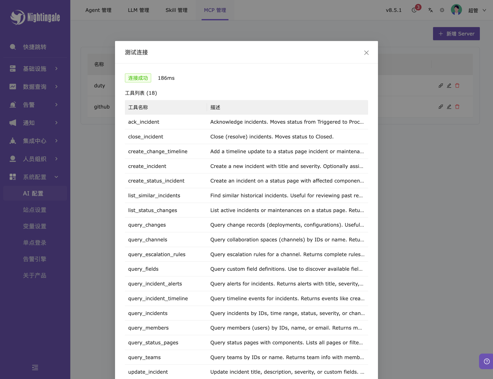

### 5.3 新增/编辑弹窗

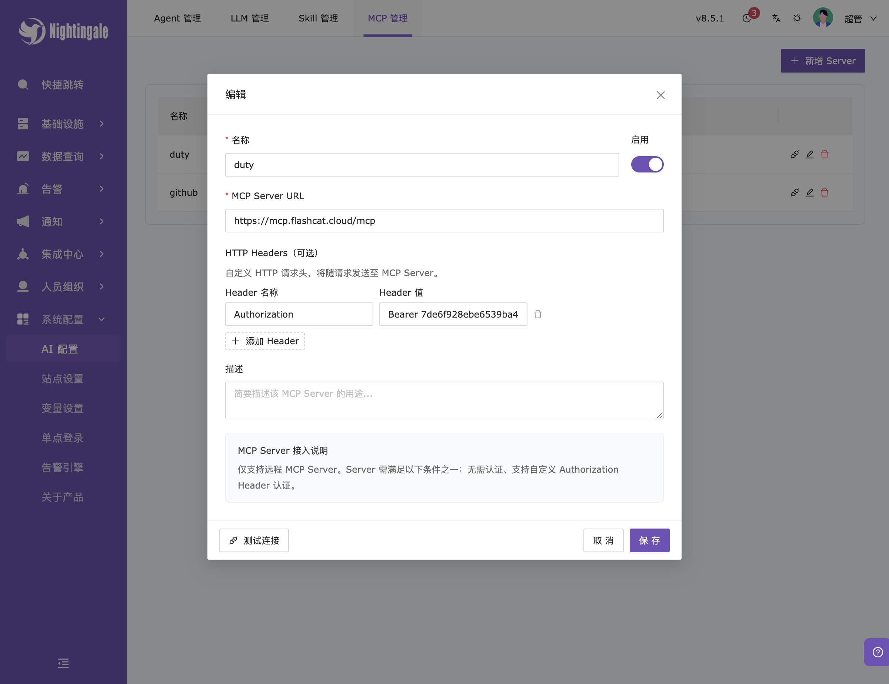

弹窗（`Modal`）宽度 640px，`destroyOnClose`。标题为 "新增 Server" 或 "编辑"。

#### 表单字段

| 字段 | 字段名 | 类型 | 必填 | Placeholder | Tooltip | 说明 |
|------|--------|------|------|-------------|---------|------|
| 名称 | `name` | `Input` 文本输入 | 是 | "请输入 MCP Server 名称" | （无） | 与"启用"同行，名称占 `flex: 1`，启用独占一列 |
| 启用 | `enabled` | `Switch` 开关 | - | - | （无） | 默认启用。与"名称"同行 |
| MCP Server URL | `url` | `Input` 文本输入 | 是 | `https://my.mcp.server.com/mcp` | （无） | |
| HTTP Headers（可选） | `headers` | 动态键值对列表（`Form.List`） | 否 | Key：`Authorization`；Value：`Bearer <token>` | （无） | label 下方有灰色说明文字："自定义 HTTP 请求头，将随请求发送至 MCP Server。"。有 header 时显示列标题行（"Header 名称" / "Header 值"，字号 12px 加粗）。每行 key/value 各占 200px 宽度，末尾有 `DeleteOutlined` 删除按钮。可通过 "添加 Header" 虚线小按钮（`type='dashed' size='small'`，`PlusOutlined` 图标）添加新行，初始值 `{ key: '', value: '' }` |
| 描述 | `description` | `Input.TextArea`（2行） | 否 | "简要描述该 MCP Server 的用途..." | （无） | `marginTop: 16` |

**信息提示框**（表单底部）：
- 带边框圆角的浅色背景卡片（`var(--fc-fill-1)` 背景，`var(--fc-border-subtle)` 边框）
- 标题："MCP Server 接入说明"（加粗，`var(--fc-text-2)` 颜色）
- 内容："仅支持远程 MCP Server。Server 需满足以下条件之一：无需认证、支持自定义 Authorization Header 认证。"
- 字号 12px，行高 1.8，颜色 `var(--fc-text-3)`

**弹窗内测试连接结果**：
- 测试中显示居中 `Spin`
- 测试完成后在信息提示框下方显示结果（`marginTop: 12`）：
  - 成功 → 绿色 Tag + 耗时（12px 灰色字体），下方显示工具列表表格（`scroll={{ y: 200 }}`，最大高度 200px 可滚动）
  - 失败 → 红色 Tag + 耗时 + 红色错误信息（12px）

**底部按钮**（`footer` 自定义布局，左右分布）：

| 按钮 | 位置 | 交互说明 |
|------|------|----------|
| 测试连接 | 底部**左侧** | 普通按钮，`ApiOutlined` 图标，带 loading。点击后：若 URL 为空则触发 URL 字段校验并返回；否则：编辑模式调用 `testMCPServer(id)`，新增模式调用 `testMCPServerConfig({ url, headers })` 传入当前表单值。成功后（仅编辑模式）额外获取工具列表 |
| 取消 | 底部**右侧** | 关闭弹窗 |
| 保存 | 底部**右侧** | 主按钮，带 loading。提交时 headers 从 `[{key, value}]` 数组转为 `{key: value}` 对象，`env_vars` 固定传空字符串。成功提示 "Created"/"Updated" |

### 5.4 数据模型

```typescript
interface MCPServer {
  id: number;              // 自增主键
  name: string;            // Server 名称
  url: string;             // Server 远程地址
  headers: Record<string, string>;  // HTTP Headers 对象，格式：{"Header-Name": "value"}
  env_vars: string;        // 环境变量（预留字段，当前固定传空字符串）
  description: string;     // 描述
  enabled: number;         // 是否启用 (0/1)
  created_at: number;      // 创建时间戳
  created_by: string;      // 创建人
  updated_at: number;      // 更新时间戳
  updated_by: string;      // 更新人
}
```

> 注意：`headers` 在数据模型中为 `Record<string, string>` 对象类型，表单中以 `{key, value}[]` 数组编辑，提交时通过 `kvToHeaders` 转换。

### 5.5 API 接口

| 方法 | 路径 | 说明 |
|------|------|------|
| GET | `/api/n9e/mcp-servers` | 获取所有 MCP Server 列表 |
| POST | `/api/n9e/mcp-servers` | 新增 MCP Server |
| PUT | `/api/n9e/mcp-server/{id}` | 更新指定 MCP Server |
| DELETE | `/api/n9e/mcp-server/{id}` | 删除指定 MCP Server |
| POST | `/api/n9e/mcp-server/test` | 测试 MCP Server 连接，请求体：`{url, headers}`，始终传入具体配置 |
| GET | `/api/n9e/mcp-server/{id}/tools` | 获取 MCP Server 提供的工具列表 |

---

## 6. 模块关系图

```
┌─────────────────────────────────────────────┐
│                   Agent                      │
│  ┌─────────┐  ┌──────────┐  ┌────────────┐ │
│  │   LLM   │  │  Skills  │  │MCP Servers │ │
│  │ (1个)   │  │ (多个)   │  │ (多个)     │ │
│  └────┬────┘  └────┬─────┘  └─────┬──────┘ │
└───────┼────────────┼──────────────┼─────────┘
        │            │              │
        ▼            ▼              ▼
   LLM 配置     Skill 配置    MCP Server 配置
   (api_type,   (instructions, (url, headers)
    model,       资源文件)
    api_key...)
```

- **Agent → LLM**：一对一关系，每个 Agent 必须关联一个 LLM 配置
- **Agent → Skill**：一对多关系，每个 Agent 可关联多个 Skill
- **Agent → MCP Server**：一对多关系，每个 Agent 可关联多个 MCP Server
- **Skill → 资源文件**：一对多关系，每个 Skill 可包含多个资源文件

---

## 7. 国际化支持

模块支持以下语言：

| 语言 | Locale 文件 |
|------|-------------|
| 简体中文 | `zh_CN.ts` |
| 英文 | `en_US.ts` |
| 繁体中文（香港） | `zh_HK.ts` |
| 日文 | `ja_JP.ts` |
| 俄文 | `ru_RU.ts` |

所有用户可见文本均通过 `useTranslation('aiConfig')` 获取，支持完整的多语言切换。

---

## 8. 权限说明

AI 配置模块位于「系统配置」菜单下，通常需要管理员权限才可访问。所有增删改操作均需要相应权限。

---

## 9. 公共字段说明

以下字段在所有资源中通用：

| 字段 | 类型 | 说明 |
|------|------|------|
| `id` | number | 自增主键，由后端生成 |
| `enabled` | number | 启用状态，0=禁用，1=启用 |
| `created_at` | number | 创建时间（Unix 时间戳） |
| `created_by` | string | 创建人用户名 |
| `updated_at` | number | 最后更新时间（Unix 时间戳） |
| `updated_by` | string | 最后更新人用户名 |

---

## 10. 通用交互模式

| 模式 | 说明 |
|------|------|
| 列表启用开关 | 所有列表页的启用列开关点击后立即调用 update 接口切换状态，无二次确认 |
| 删除确认 | 所有删除操作均使用 `Popconfirm` 组件弹出确认框 |
| 表单提交 | 所有表单提交按钮均有 loading 状态防重复提交，成功后显示 "Created"/"Updated"/"Deleted" 英文提示 |
| 表格分页 | 所有列表表格均不分页（`pagination={false}`） |
| 表格容器 | Agent、LLM、MCP 列表均使用 `fc-border` class 容器包裹，带 `var(--fc-radius-md)` 圆角和 16px 内边距 |
| 抽屉/弹窗销毁 | 所有 Drawer 和 Modal 均设置 `destroyOnClose`，关闭时销毁表单状态 |
