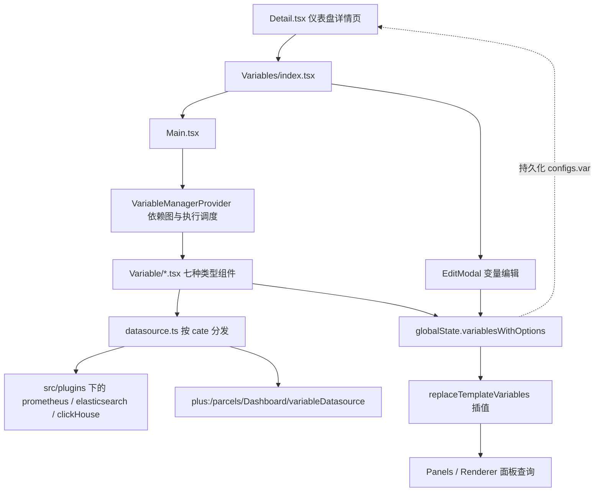
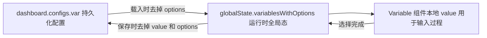
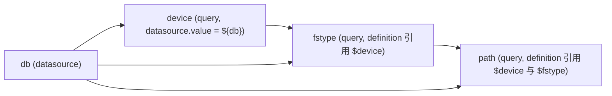
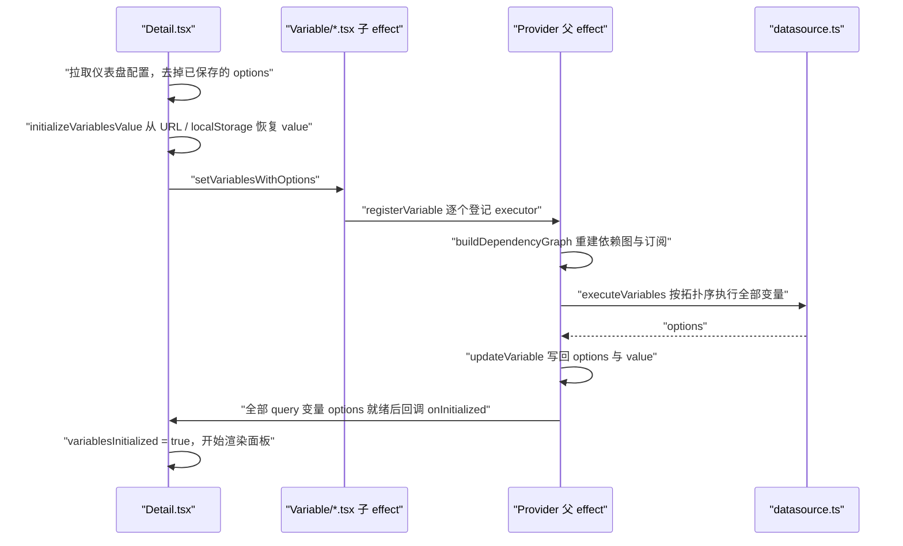

# 仪表盘变量（Variables）

仪表盘变量为面板查询提供可交互的参数。用户在仪表盘顶部选择变量值，面板查询中的 `$var` 占位符被替换为实际值后再发起请求。变量之间可以相互引用，形成依赖链。

当前实现位于 `src/pages/dashboard/Variables/`（v3.2 重构）。同级的 `VariableConfig/` 是旧版实现，仪表盘详情页已不再使用，但内置仪表盘导入（`List/Import/ImportBuiltinContent.tsx`）以及若干工具函数（`escapePromQLString`、`stringToRegex` 等）仍在复用它。

## 目录结构

```
src/pages/dashboard/Variables/
├── index.tsx                    # 模块入口：渲染 Main + EditModal，追踪初始化完成并回调 onInitialized
├── Main.tsx                     # 挂载 VariableManagerProvider，渲染变量组件，同步 URL 与 localStorage
├── VariableManagerContext.tsx   # 核心：依赖图、reconcile、执行调度、订阅
├── types.ts                     # IVariable / VariableExecutionMeta / DependencyGraph / QueryOption
├── constant.ts                  # 变量类型选项、多选拼接分隔符
├── datasource.ts                # 按数据源 cate 分发变量查询
├── plugins.ts                   # 变量插件注册表（内置 + Plus 扩展）
├── builtinPlugins.ts            # 开源内置插件注册（当前为空，预留扩展点）
├── pluginTypes.ts               # DashboardVariablePlugin 接口
├── Variable/                    # 运行时展示组件，每种类型一个
│   ├── index.tsx                # 按 type 路由到具体组件
│   ├── Query.tsx                # query：调用 datasource.ts 拉取 options
│   ├── Datasource.tsx           # datasource：从 groupedDatasourceList 生成 options
│   ├── DatasourceIdentifier.tsx # datasourceIdentifier：同上，值为 identifier
│   ├── Custom.tsx               # custom：解析 definition 的逗号分隔值
│   ├── Constant.tsx             # constant：definition 即为值
│   ├── Textbox.tsx              # textbox：自由输入
│   └── HostIdent.tsx            # hostIdent：调用 getMonObjectList
├── EditModal/                   # 变量编辑弹窗
│   ├── index.tsx                # 变量列表：增删改排序，保存时写回全局态并回调 onChange
│   ├── Variable/                # 各类型的编辑表单
│   ├── Querybuilder.tsx         # 按 cate 渲染对应的查询构造器
│   └── Preview.tsx              # 编辑态「数据预览」
└── utils/
    ├── initializeVariablesValue.ts  # 首次加载：从 URL / localStorage 恢复 value
    ├── ajustData.ts                 # 构建插值映射表（含多选拼接、All 展开）
    ├── formatString.ts              # 占位符替换；formatDatasource 解析数据源 ID
    ├── replaceTemplateVariables.ts  # 对外插值入口；getBuiltInVariables 提供内置变量
    ├── processQueryOptions.ts       # 规范化查询结果、正则过滤与命名捕获组
    ├── filterOptionsByReg.ts        # 字符串选项的正则过滤
    ├── getValueByOptions.ts         # options 就绪后确定变量值
    ├── stringToRegex.ts             # 字符串转正则（支持 /pattern/flags）
    ├── escapeString.ts              # PromQL / JSON 转义
    ├── isPlaceholderQuoted.ts       # ES 场景判断占位符是否已被引号包裹
    └── includes.ts                  # 判断值是否存在于 options 中
```

## 分层架构



## 数据模型

### 变量类型

| type | 值的来源 | 是否发起查询 | 是否参与依赖分析 |
| --- | --- | --- | --- |
| `query` | 数据源查询结果 | 是 | 是（唯一会声明依赖的类型） |
| `datasource` | 按 `definition`（cate）筛选的数据源列表，值为数据源 ID | 否 | 否，但可被引用 |
| `datasourceIdentifier` | 同上，值为 `identifier` 字符串 | 否 | 否，但可被引用 |
| `custom` | `definition` 的逗号分隔值 | 否 | 否 |
| `constant` | `definition` 直接作为值 | 否 | 否 |
| `textbox` | 用户输入，回落到 `defaultValue` | 否 | 否 |
| `hostIdent` | `getMonObjectList` 接口 | 是 | 否 |

「参与依赖分析」指该变量是否会被解析出对其他变量的引用。只有 `query` 类型会：其他类型即使在 `regex` 等字段里写了 `$var`，也不会建立依赖边（插值仍会在执行时生效）。

### IVariable 关键字段

定义见 `Variables/types.ts`。除常规的 `name` / `type` / `label` / `hide` 外，需要留意：

- `definition`：主查询表达式。不同类型语义不同（query 是查询语句，datasource 是 cate，custom 是逗号分隔值，constant 是常量本身）。
- `query`：v8 起新增的结构化查询条件，字段随数据源而异。其中所有字符串字段都会参与插值与依赖分析。
- `datasource.value`：可以是数字 ID，也可以是 `"${db}"` 这样引用其他变量的字符串。
- `reg` / `regex`：`reg` 过滤 query 结果，`regex` 过滤数据源列表。
- `multi` / `allOption` / `allValue`：多选与 All 选项。
- `options` / `value`：运行时产物，不持久化。

### 三层状态



`Detail.tsx` 在保存时会 `_.omit(item, ['value', 'options'])`，因此 `value` 和 `options` 只存在于运行时。组件本地 `value` 是为了让多选下拉在展开期间不逐项触发查询，收起或单选时才写回全局态。

## 运行时执行模型

### 职责划分

`VariableManagerProvider` 是唯一的调度中心，变量组件只做两件事：登记自己的 `executor`，以及在用户交互时调用 `updateVariable` 写回值。

- **组件侧**（`Variable/*.tsx`）：在 `useEffect([variableConfigSignature])` 中调用 `registerVariable({ name, variable, executor })`。`executor` 通过 `variableRef` / `rangeRef` 读取最新配置和时间范围，因此不需要随每次渲染重新注册。
- **Provider 侧**：`registerVariable` 只写入注册表，不做依赖分析、不触发执行。依赖图构建与执行调度全部集中在 reconcile effect 中。

这个划分是必须的。React 的 effect 执行顺序是**子先父后**，只有父组件的 effect 才能同时看到完整的变量列表和完整的注册表。如果让子组件在注册时自行决定"要不要执行"，新增变量时它看到的初始化状态是上一轮遗留的，会出现无人执行的空档。

### 依赖图

`buildDependencyGraph(variables)` 是纯函数，只依赖变量配置。对每个 `query` 变量扫描四处：`definition`、`query.query`、`datasource.value`、以及 `query` 对象的全部字符串字段（CloudWatch 一类数据源把变量引用放在 `query.region` 等子字段里）。

占位符语法三种都支持：`$var`、`${var}`、`[[var]]`。引用不存在的变量会被过滤；自引用会被剔除，否则拓扑排序会将其判定为循环依赖。

产物有两份：

- `graph`：`{ 被依赖的变量名: [依赖它的变量名] }`，用于向下游传播。
- `dependenciesByName`：`{ 变量名: [它依赖的变量名] }`，用于拓扑排序算入度。

以本文档常用的例子为例：



### reconcile

变量列表或配置发生变化时（以排除了 `label` / `value` / `options` / `hide` 的**逐变量配置签名**判定），Provider 的 reconcile effect 会：

1. 删除已不存在的变量的注册项；
2. 用 `buildDependencyGraph` **整体重建**依赖图，并为**全部**已注册变量刷新依赖与订阅；
3. 确认所有变量都已注册，否则本轮不推进签名，等组件就绪后重来；
4. 决定执行集合并按拓扑序执行。

第 2 步必须覆盖全部注册项，而不只是配置变化的那些。因为组件的注册 effect 只在自身配置签名变化时才重跑，配置没变的老变量不会重新注册——如果只重建变化部分，它们的依赖边会永久丢失。

执行集合分两种情况：

- **首轮**（`initialized` 为 false）：执行全部变量。
- **增量**（已初始化）：取配置发生变化的变量，沿 `graph` 展开出全部传递下游，去重后执行。新增的变量在上一轮签名中不存在，天然被识别为变化。

每轮 reconcile 持有一个递增的 token，执行过程中每步都会检查是否已被更新的一轮取代，以便尽早中止。

### 首次加载时序



面板要等 `onInitialized` 之后才渲染，避免用未就绪的变量值发起查询。判定条件是所有 `query` 变量的 `options` 属性存在（空数组也算就绪）。

### 用户改值的级联

用户在下拉框选择新值时走的是另一条路径：`updateVariable` 写回值并通知该变量的订阅者，订阅回调触发 `triggerDependencyUpdate`，后者查 `graph` 找到全部下游、拓扑排序后依次执行。

执行链期间 `isExecutingChain` 为 true，此时链内的 `updateVariable` 不再通知订阅者，避免同一条链被重复触发。

### 时间范围变化

时间范围变化时，`refreshQueryVariablesForRangeChange` 会按拓扑序重跑全部已注册的 `query` 变量。

这里有一个容易出错的时序：`Detail.tsx` 的本地 `range` 是通过 effect 同步到 globalState 的，Provider 首次渲染时拿到的还是默认值 `now-1h`，之后才被改写成仪表盘的真实范围，而此时变量列表通常还是空的。因此：

- 变量尚未完成首轮执行时，时间范围变化**不做任何处理**，因为首轮执行本来就会使用最新的时间范围；
- 首轮执行开始时，reconcile 会把当前时间范围签名记为已处理，防止随后触发一轮重复刷新。

如果缺了这两步，页面加载时会出现首轮执行与范围刷新两条链并发推进，每个变量被查询两次。

## 插值

`replaceTemplateVariables(str, params)` 是对外的统一入口，面板查询、文本面板、链接等都走它。流程是先用 `adjustData` 把变量列表压成 `{ 变量名: 插值结果 }` 的映射表，再交给 `formatString` 做替换。

几个要点：

- **三种语法**：`$var`、`${var}`、`[[var]]`。`$var` 会做最长前缀匹配，`$devicename` 在只存在 `device` 变量时会替换成 `${device}name`。
- **多选拼接**：由数据源决定分隔符，见 `constant.ts` 的 `replaceAllSeparatorMap`（Prometheus 用 `|`，ES 用 ` OR `），多个值会被括号包裹；MySQL 走 Grafana sqlstring 风格，逐值加单引号。
- **All 选项**：值为 `['all']` 时，若配置了 `allValue` 就用它，否则展开为全部 options 的拼接。
- **转义**：Prometheus 走 `escapePromQLString`，ES 视占位符是否已被引号包裹决定是否补引号并做 JSON 转义。
- **数据源变量**：`formatDatasource` 会把插值结果转成数字 ID，供查询请求使用。
- **内置变量**：`getBuiltInVariables` 提供 `$__from`、`$__to`、`$__interval`、`$__range` 等时间相关变量，随插值一起注入，不需要用户定义。

## 查询与选项处理

`datasource.ts` 按 `datasourceCate` 分发：Prometheus、Elasticsearch、ClickHouse 走 `src/plugins/` 下各自的 `variableDatasource`，其余交给 Plus 的 `plus:/parcels/Dashboard/variableDatasource`。

查询结果由 `processQueryOptions` 规范化。它同时接受标量数组（`['a', 'b']`）和对象数组（`[{ label, value }]`），统一产出 `{ label: string, value: string }[]` 并按 value 排序去重。`reg` 支持两种写法：普通字符串按全等匹配，`/pattern/flags` 按正则匹配；正则可以用命名捕获组 `(?<text>...)` 和 `(?<value>...)` 分别指定展示文本与实际值。

options 就绪后由 `getValueByOptions` 决定值：已有值且仍在 options 中就保留，否则回落到 `defaultValue`，再否则取第一项（多选且开了 All 时取 `['all']`）。URL 带 `__variable_value_fixed` 时跳过这套逻辑，保持传入值不变。

## 插件机制

`pluginTypes.ts` 定义了 `DashboardVariablePlugin`，按数据源 cate 注册，提供两个能力：

- `capabilities(query)`：声明该数据源在当前查询条件下是否支持多选与 All，编辑表单据此显示或隐藏对应开关。
- `transformQuery(query, context)`：面板查询构建时替代通用插值逻辑（见 `Renderer/datasource/contract.ts`）。返回 `undefined` 表示依赖尚未就绪，本次不发起查询。

注册表由 `builtinPlugins.ts`（开源内置，目前为空）与 `plus:/parcels/Dashboard/variablePlugins`（Plus 扩展）合并而成，同名以 Plus 为准。未注册的 cate 继续走原有的通用流程。

## 值的持久化与恢复

| 载体 | 写入时机 | 用途 |
| --- | --- | --- |
| `dashboard.configs.var` | 编辑变量后保存仪表盘 | 变量定义，不含 `value` / `options` |
| URL query | 变量值变化时 `history.replace` | 分享链接、跨页携带 |
| localStorage | 变量值变化时，键为 `dashboard_v6_{dashboardId}_{name}` | 同一用户下次访问时恢复上次选择 |

`initializeVariablesValue` 在首次加载时按 URL 优先、localStorage 兜底的顺序恢复值，并做类型归一：datasource 变量转数字，多选转数组，单选取数组首项，空值统一为 `undefined`（textbox 例外，回落到 `defaultValue` 或空字符串）。URL 中带 `__variable_value_fixed` 时不读 localStorage，也不再自动补默认值。

## 关键约束

改动这块代码时容易破坏的几条不变量：

1. **依赖图必须整体重建**。配置未变的变量不会重新注册，只重建变化部分会让它们的依赖边丢失。
2. **执行调度必须留在 Provider 的 effect 里**。子组件的 effect 先于父组件执行，在那里判断"要不要执行"看到的是上一轮的状态。
3. **首轮执行要同时认领当前时间范围**，否则会与范围刷新并发，导致每个变量被查询两次。
4. **不要给批量执行加串行队列**。系统靠 `Query.tsx` 的 `requestIdRef` 丢弃过期响应来处理并发，串行队列会让一个悬挂的请求阻塞后续所有执行。
5. **配置签名必须排除 `label` / `value` / `options` / `hide`**。这些字段在每次查询后都会变化，纳入签名会造成无限重执行。
6. **`executor` 通过 ref 读取最新配置**，因此注册 effect 只依赖配置签名，不要改成每次渲染都重新注册。

## 测试

- `__tests__/VariableManagerContext.test.ts`：依赖分析与拓扑排序的纯函数单测。
- `__tests__/variableLifecycle.jsdom.test.tsx`：生命周期集成测试，覆盖新增 / 编辑 / 删除变量、依赖联动、时间范围与初始化的时序。
- `__tests__/queryOptions.jsdom.test.tsx`：查询选项集成测试，覆盖下拉交互、多选与 All、正则、过期响应、失败恢复，并对比编辑态预览与运行时的一致性。
- `__tests__/plugins.test.ts`：插件注册表的合并与覆盖规则。
- `utils/__tests__/`：插值、初始化、选项处理等工具函数单测。

运行：`npx jest src/pages/dashboard/Variables`。这两个 jsdom 套件较重，在高并行度下偶尔会触发 5 秒用例超时，可加 `--maxWorkers=2`。
