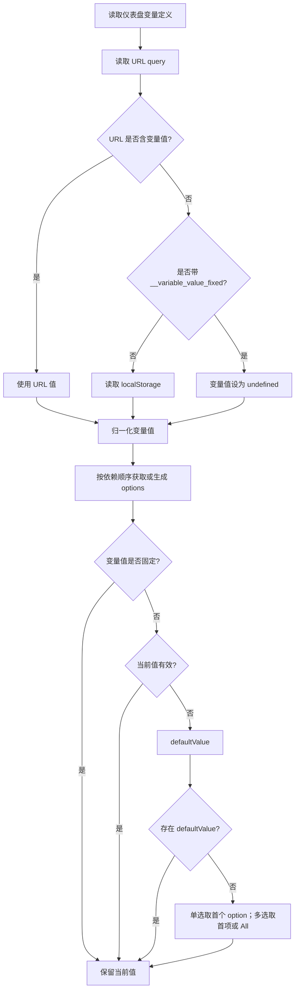

# 仪表盘变量值执行流程

本文说明仪表盘变量在详情页加载、用户修改和重新访问时，URL、localStorage 与可选项之间的优先级和处理方式。

## 值的来源和优先级

变量首次加载时依次读取：

1. URL 中与变量同名的参数；
2. localStorage 中的 `dashboard_v6_{dashboardId}_{variableName}`；
3. 变量查询或配置生成的 options。

URL 值优先于 localStorage。只有 URL 中没有该变量的值，且 URL 不带 `__variable_value_fixed` 时，才读取 localStorage。

`__variable_value_fixed` 表示当前链接固定变量值：不读取 localStorage，也不根据 options 自动补默认值。该开关用于分享、嵌入等需要严格使用链接参数的场景。

## 首次加载

归一化规则：非文本框变量的 `null`、`undefined`、空字符串和空数组会视为未赋值；数据源变量会将数字字符串转为数字；多选变量会将单个字符串转为数组；单选变量会从数组中取第一项。文本框变量没有值时使用 `defaultValue`，否则为空字符串。

## options 返回后的校验和回填

非固定变量在 options 就绪后执行如下顺序：

1. 当前值存在于 options 中，保留当前值；
2. 当前值未赋值或已不在 options 中，且配置了 `defaultValue`，使用该默认值；
3. 否则使用首个 option；多选变量开启 All 时使用 `['all']`；
4. 没有 options 时保持 `undefined`，文本框保持空字符串。

因此，普通 URL 值和 localStorage 恢复值都会参与 options 校验：若值已不在 options 中，将回退到默认值或首项。带 `__variable_value_fixed` 的 URL 值则不会回退。

## 用户修改后的写回

用户在变量控件中选择或输入值后：

1. 更新 `variablesWithOptions` 中的运行时值；
2. 值不是 `undefined` 时写入 localStorage；
3. 将非空、非 `undefined`、非 `null` 的变量值写入 URL；
4. 通知依赖该变量的下游变量重新查询 options。

运行时 `undefined` 不会覆盖 localStorage 中已有的记录；单选控件明确清空时会写入空字符串，下一次加载时会按未赋值处理。

## 变量联动期间的面板查询

变量管理器执行用户选择、时间范围刷新或变量配置变更引起的依赖链时，会标记变量执行中。面板在执行期间会取消尚未发出的防抖查询、中止正在进行的旧请求，并等待所有下游变量的 options 和值稳定。

执行链结束后，变量稳定版本递增；每个可见面板再用最终变量值发起一次查询。这样不会减少变量获取 options 的必要请求，但避免了 `service → metric → label_key → label_values` 等中间状态分别触发面板 `query-batch` 请求。

### 执行会话与页面切换

执行状态保存为 `{ sessionId, isExecuting, revision }`。每个 `VariableManagerProvider` 挂载时领取新的 `sessionId`；只有当前会话可以把状态从执行中切换为稳定。Provider 卸载时会复位自己仍持有的执行状态，旧页面的异步变量请求即使随后返回，也不能覆盖新页面会话。

因此，页面切换期间不会因为旧变量链悬挂而让新页面的面板永久停止查询。不过变量、时间范围等仍是仪表盘模块级全局状态；同一 React 树内多个仪表盘实例并存尚不支持，详见同级 [README.md](./README.md)。

## 示例

| URL                                               | localStorage  | options                  | 最终值        |
| ------------------------------------------------- | ------------- | ------------------------ | ------------- |
| `project=project-2`                               | `project-1`   | `project-1`, `project-2` | `project-2`   |
| 无 `project`                                      | `project-2`   | `project-1`, `project-2` | `project-2`   |
| 无 `project`                                      | `project-old` | `project-1`, `project-2` | `project-1`   |
| `project=project-old`                             | `project-1`   | `project-1`, `project-2` | `project-1`   |
| `__variable_value_fixed=true&project=project-old` | `project-1`   | `project-1`, `project-2` | `project-old` |
